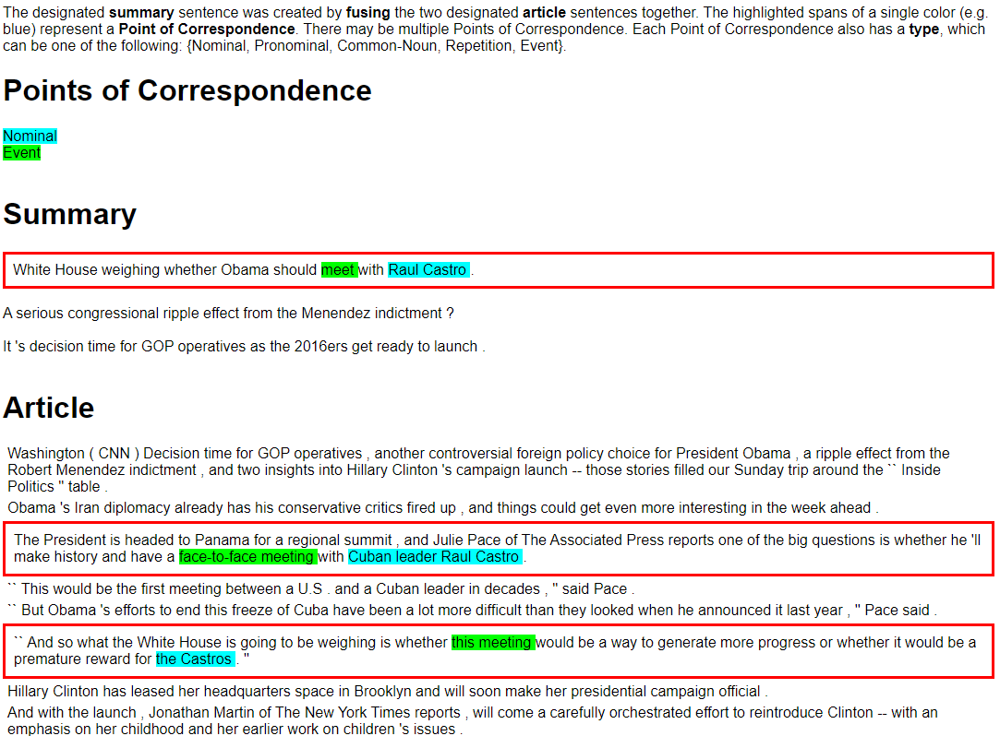

# Understanding Points of Correspondence between Sentences for Abstractive Summarization
Dataset for the ACL SRW 2020 paper [Understanding Points of Correspondence between Sentences for Abstractive Summarization](https://arxiv.org/abs/2006.05621)

# Dataset
The dataset contains 1,599 sentence fusion examples with fine-grained *Points of Correspondence* annotations. A *Point of Correspondence* is an entity or event that connects two sentences together, which is represented as a span of text from each sentence. [Click here to see an example](#example-visualization).

Our dataset is in JSON format in the file `PoC_dataset.json`. Each example has the following attributes:
>
>**Sentence_1:** Tokenized input sentence 1.
>
>**Sentence_2:** Tokenized input sentence 2.
>
>**Sentence_Fused:** Fused sentence created by merging Sentence_1 and Sentence_2.
>
>**Sentence_1_Index:** Position of sentence in Full_Article.
>
>**Sentence_2_Index:** Position of sentence in Full_Article.
>
>**Sentence_Fused_Index:** Position of fused sentence in Full_Summary.
>
>**Full_Article:** Full CNN news article. Each sentence is separated by tabs.
>
>**Full_Summary:** Summary of the article. Each sentence is  separated by tabs.
>
>**PoCs:** List of Points of Correspondence. Each PoC has the following attributes:
>
>>**Sentence_1_Selection:** Token indices for beginning and end of the Point of Correspondence in input sentence
>>
>>**Sentence_2_Selection:** Token indices for beginning and end of the Point of Correspondence in input sentence
>>
>>**Sentence_Fused_Selection:** Token indices for beginning and end of the Point of Correspondence in fused sentence
>>
>>**PoC_Type:** Can be {Nominal, Pronominal, Common-Noun, Repetition, Event}

# Example Visualization
We provide visualizations of every dataset example in the directory `PoC_visualizations/`, which can be opened in any browser, along with the code used to create them in `visualize_poc.py`.

An example is shown below:

>